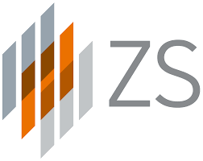

## ZS Associates
- *Business Technology Solutions Associate* | Aug'22 - Present
- 
- Tags: Full-Time Role
- Badges:
  - Badge [blue]
- List Items:
  - Developed an end-to-end Control Tower and Quality Risk Monitoring system to implement complex business logics and algorithms with actionable insights using pipelines processing 5TB clinical trials data using PySpark, Azure.
  - Tackled complex time series analysis and mechanisms like stitching logic and data archival with Python, PySpark.
  - Implemented a comprehensive application to track new pharmaceutical products being launched with optimizations increasing sales by 30% and efficiency by 60% using AWS, Pyspark and Directed Acyclic Graph algorithm.
  - Use Agile framework, write documentation and collaborate with cross-functional teams as a backend developer.

## ZS Associates
- *Business Technology Solutions Associate – Intern* | Feb'22 - Jul'22
- 
- Tags: Intern
- Badges:
  - Badge [blue]
- List Items:
  - Constructing Big Data models, APIs, scalable databases capable of ETL process using Spark, Python, SQL, AWS.
  - Working on Databricks and Spark to construct data pipelines that processed huge amounts of data daily.

## AmeyaSmart Labs Ventures Pvt Ltd
- *Fullstack Development Intern* | May'2020 - Jun'21
- 
- Tags: Intern
- Badges:
  - Badge [blue]
- List Items:
  - Collaborate on various layers of the infrastructure of the platform and applications.
  - Develop UI/UX on web pages. I received 5/5 rating as the instructor for the Python EdTech Course venture.